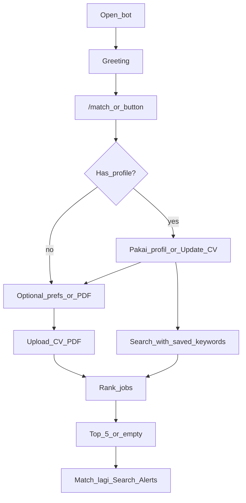

# JobMatch Helper — Product & UX Design

**Bot:** JobMatch Helper (`@jobmatch_tools_bot`)  
**Type:** Telegram bot (jobseeker-focused)  
**Sibling product:** `@cv_screener_bot` (ATS: JD vs CV score) — **tetap terpisah**  
**Goal:** Upload CV → ranked job matches from Indonesia catalog + Adzuna  

---

## 1. Positioning

| | CV Screener | JobMatch Helper |
|---|---|---|
| User | Candidate / siapa pun cek 1 JD | Jobseeker cari peluang |
| Input | JD (+ link) + CV | CV (+ preferensi opsional) / keyword search |
| Output | % match vs 1 JD | Ranked list job recommendations |
| Analogi | “Simulasi ATS” | “Mini job board dari CV” |

**One-liner**  
> Upload CV-mu, dapatkan daftar lowongan yang paling cocok — langsung di Telegram.

---

## 2. Design principles

1. **CV-first** — langkah utama = upload CV (boleh langsung di step preferensi)
2. **List, not lecture** — hasil = ranking singkat (top 5)
3. **Honest limits** — Indo catalog + Adzuna (`sg`/global); jangan klaim “seluruh internet”
4. **Focused bot** — soft CTA ke `@cv_screener_bot`; no Share TG/WA buttons (native Telegram share)
5. **Privacy** — CV in-memory; persist skill keywords + prefs only for rematch/alerts

---

## 3. Scope (shipped)

### In scope
- `/start`, `/match`, `/search`, `/alerts`, `/profile`, `/cancel`, `/help`, `/done`
- Upload CV PDF → keyword extract → merge **Indo JSON** + **Adzuna** → top 5
- Preferensi opsional; PDF allowed on prefs step
- Returning: **Pakai profil** / **Update CV** (Update clears prefs)
- Alerts: instant ≥70% + daily digest 09:00 WIB (≥40%)
- Soft redirects for photo/sticker/voice/etc.

### Out of scope
- Scraping JobStreet / LinkedIn live
- AI/LLM matching
- OCR CV scan
- Apply langsung ke perusahaan
- Web dashboard

---

## 4. Data sources

| Source | Path / API | Notes |
|---|---|---|
| Indo catalog | `data/jobs-id.json` (`INDO_JOBS_PATH`) | Cities like Jakarta filter here only |
| Adzuna | `ADZUNA_COUNTRY=sg` (no `id` index) | Timeout 15s; Indo cities not sent as `where` |
| SQLite | `DATA_DIR` | Users, seen jobs, digest date |

Dedupe: title|company — Indo wins.  
`example.com` catalog URLs are placeholders — no Open link shown.

---

## 5. User journey



---

## 6. Main keyboards

**Greeting / idle**
```text
[ Cari job match ] [ Search ]
[ Alerts ] [ Bantuan ]
```

**After results**
```text
[ Match lagi ] [ Update CV ]
[ Search ] [ Alerts ]
[ Selesai ]
```

No Share Telegram / WhatsApp buttons.

---

## 7. Score bands

| Score | Label | Alerts |
|---|---|---|
| 70–100% | Strong match | Instant notify |
| 40–69% | Partial match | Daily digest |
| 0–39% | Weak match | Mark seen; empty UI if top too weak |

Empty when no jobs, or top-1 &lt; 40% and all &lt; 15%, or top-1 &lt; 15%.

---

## 8. Commands (BotFather)

```text
start - Mulai & cara pakai
match - Cari job dari CV
search - Cari by judul/keyword
alerts - Notifikasi lowongan baru
profile - Lihat profil tersimpan
cancel - Batalkan session
done - Selesai + thank you
help - Bantuan singkat
```

---

## 9. Session + persistence

**In-memory session:** `idle | awaiting_prefs | awaiting_cv | awaiting_search`  
**SQLite:** keywords, prefs, alerts flag, lastDigestDate, seen job ids  

PDF never stored. Language: Indonesian primary + light English.

---

## 10. Deploy notes

- Railway polling, Node 20+
- Volume at `/data` only (`DATA_DIR=/data`); keep `INDO_JOBS_PATH=./data/jobs-id.json` on image FS
- Stop local poller when production is up
- See README Deploy section

---

## 11. Relationship with CV Screener

JobMatch = **discovery** (banyak job dari CV).  
CV Screener = **validation** (satu JD vs CV).  

> JobMatch kasih kandidat job → user buka JD → CV Screener cek skor detail.
